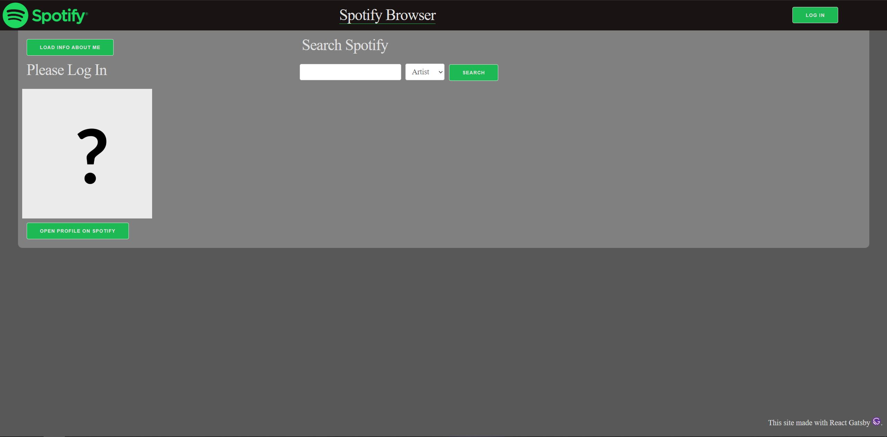
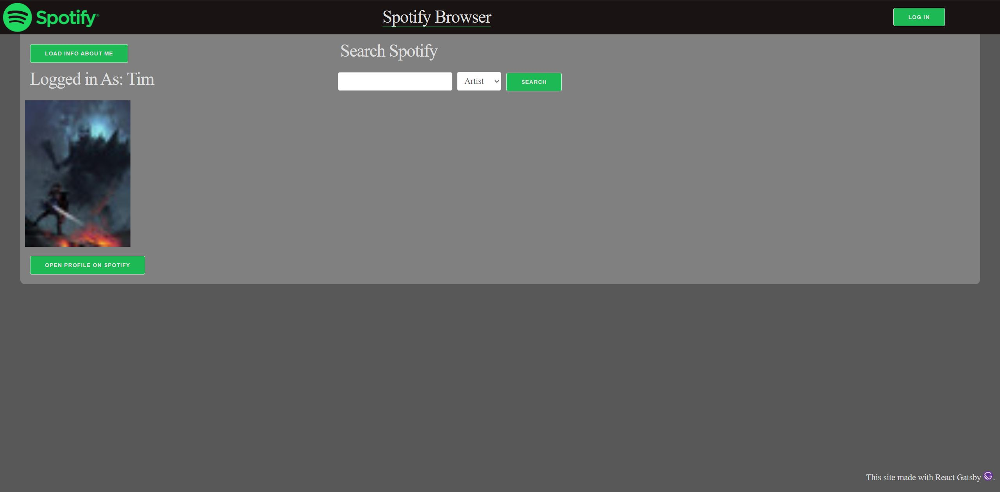
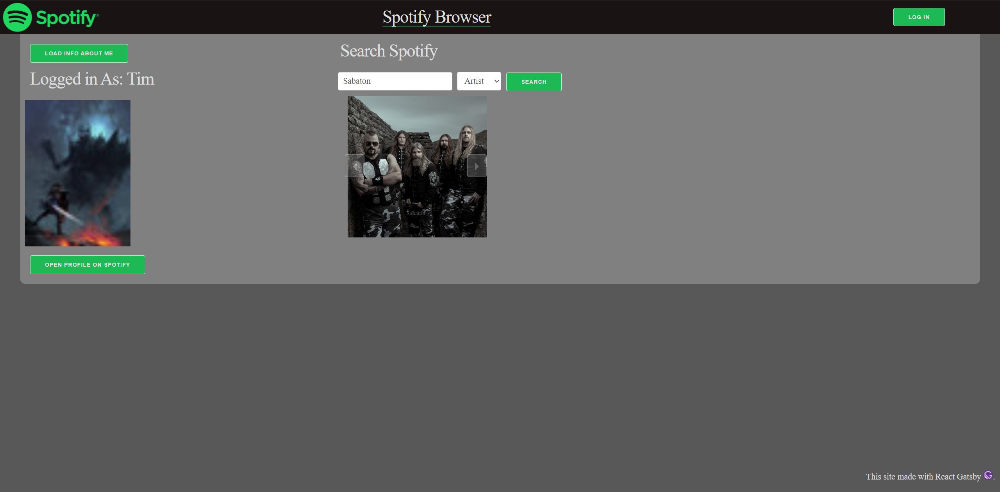
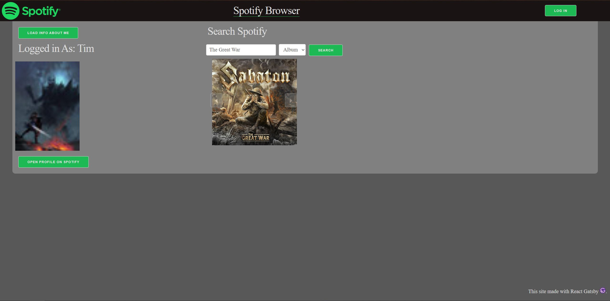
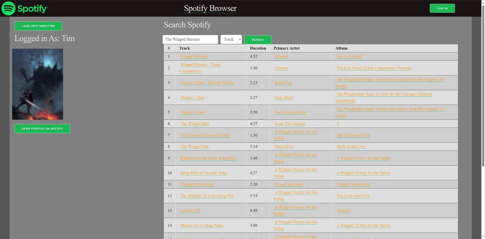
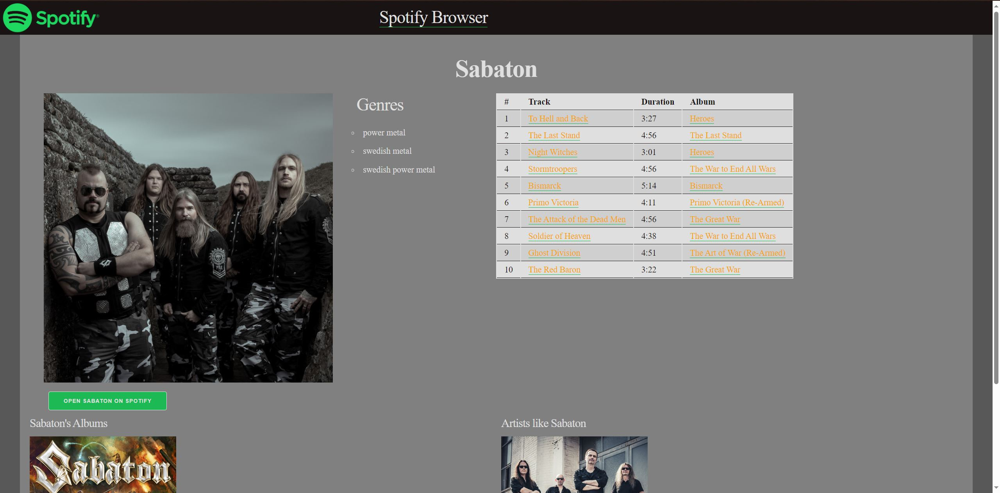
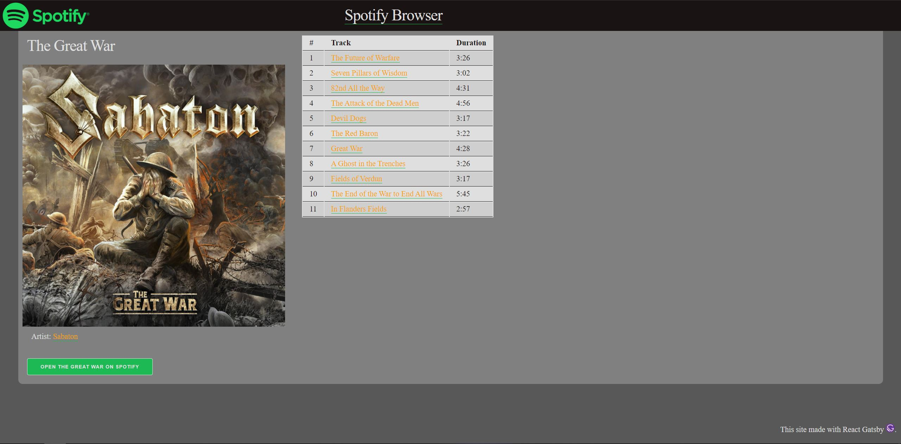
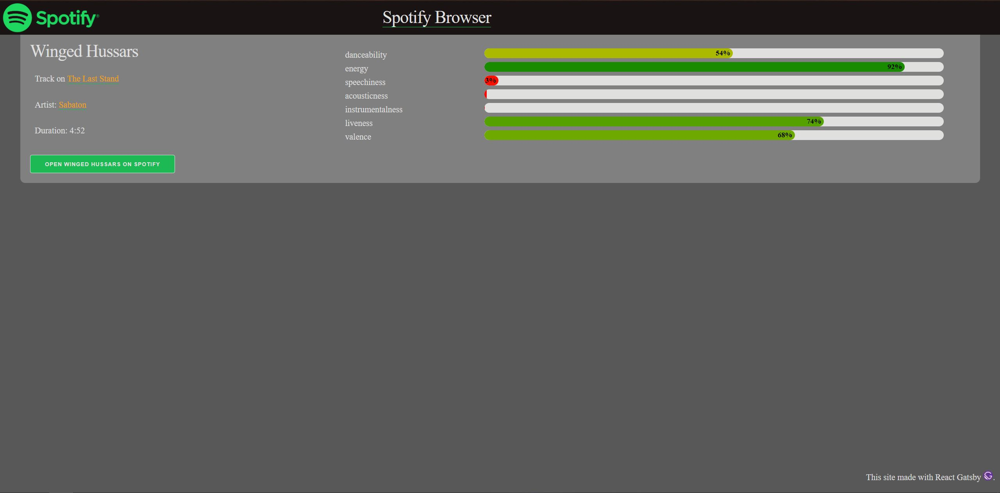

# Demo of the Spotify Browser

The browser opens on the home page:

Clicking the `Log In` button on the top right and then the `Load Info About Me` button on the top left accesses the Spotify API to log in and retrieve profile information about the user, which is displayed. There is a link to open your profile on spotify. A user can return to the Home page at any time by clicking the `Spotify Browser` header link.

Through the search bar, you can search for Artists, Albums, and Tracks. Searching for either Artists or Albums results in a clickable Carousel of results, while searching for Tracks results in a table.

Clicking on the Artist/Album/Track takes a user to a page with details on that Artist/Album/Track.

